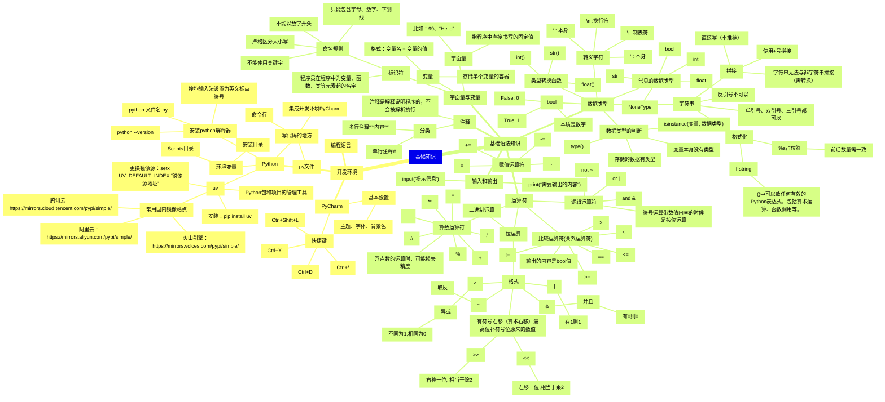

# 基础知识（大纲笔记）（思维导图）

> 由 Excalidraw 手绘图自动还原，改图请回 Obsidian 重画后重新同步。

```mermaid
mindmap
  n0["基础知识"]
    n1["开发环境"]
      n2["编程语言"]
      n3["Python"]
        n4["写代码的地方"]
          n5["命令行"]
          n6["py文件"]
          n7["集成开发环境PyCharm"]
        n8["uv"]
          n9["Python包和项目的管理工具"]
          n10["安装：pip install uv"]
          n11["更换镜像源：setx UV_DEFAULT_INDEX '镜像源地址'"]
          n12["常用国内镜像站点"]
            n13["阿里云：https://mirrors.aliyun.com/pypi/simple/"]
            n14["腾讯云：https://mirrors.cloud.tencent.com/pypi/simple/"]
            n15["火山引擎：https://mirrors.volces.com/pypi/simple/"]
        n16["安装python解释器"]
          n17["python --version"]
          n18["python 文件名.py"]
          n19["搜狗输入法设置为英文标点符号"]
        n20["环境变量"]
          n21["安装目录"]
          n22["Scripts目录"]
      n23["PyCharm"]
        n24["基本设置"]
          n25["主题、字体、背景色"]
        n26["快捷键"]
          n27["Ctrl+D"]
          n28["Ctrl+X"]
          n29["Ctrl+Shift+L"]
          n30["Ctrl+/"]
    n31["基础语法知识"]
      n32["注释"]
        n33["分类"]
          n34["单行注释#35;"]
          n35["多行注释“”“内容”“”"]
        n36["注释是解释说明程序的，不会被解析执行"]
      n37["字面量与变量"]
        n38["字面量"]
          n39["指程序中直接书写的固定值"]
          n40["比如：99、“Hello”"]
        n41["变量"]
          n42["存储单个变量的容器"]
          n43["格式：变量名 = 变量的值"]
        n44["标识符"]
          n45["程序员在程序中为变量、函数、类等元素起的名字"]
          n46["命名规则"]
            n47["只能包含字母、数字、下划线"]
            n48["不能以数字开头"]
            n49["不能使用关键字"]
            n50["严格区分大小写"]
      n51["数据类型"]
        n52["常见的数据类型"]
          n53["int"]
          n54["float"]
          n55["bool"]
          n56["str"]
          n57["NoneType"]
        n58["数据类型的判断"]
          n59["type#40;#41;"]
          n60["isinstance#40;变量, 数据类型#41;"]
          n61["变量本身没有类型"]
          n62["存储的数据有类型"]
        n63["类型转换函数"]
          n64["int#40;#41;"]
          n65["str#40;#41;"]
          n66["float#40;#41;"]
        n67["bool"]
          n68["True: 1"]
          n69["False: 0"]
          n70["本质是数字"]
        n71["转义字符"]
          n72["\' : 本身"]
          n73["\' : 本身"]
          n74["\n :换行符"]
          n75["\t :制表符"]
        n76["字符串"]
          n77["单引号、双引号、三引号都可以"]
          n78["反引号不可以"]
          n79["拼接"]
            n80["直接写（不推荐）"]
            n81["使用+号拼接"]
            n82["字符串无法与非字符串拼接（需转换）"]
          n83["格式化"]
            n84["%s占位符"]
              n85["前后数量需一致"]
            n86["f-string"]
              n87["#123;#125;中可以放任何有效的Python表达式，包括算术运算、函数调用等。"]
      n88["输入和输出"]
        n89["print#40;“需要输出的内容”#41;"]
        n90["input#40;'提示信息'#41;"]
      n91["运算符"]
        n92["算数运算符"]
          n93["+"]
          n94["-"]
          n95["*"]
          n96["/"]
          n97["//"]
          n98["%"]
          n99["**"]
          n100["浮点数的运算时，可能损失精度"]
        n101["赋值运算符"]
          n102["="]
          n103["+="]
          n104["-="]
          n105["..."]
        n106["比较运算符#40;关系运算符#41;"]
          n107[">"]
          n108["<"]
          n109["=="]
          n110[">="]
          n111["<="]
          n112["!="]
          n113["输出的内容是bool值"]
        n114["逻辑运算符"]
          n115["and &"]
          n116["or |"]
          n117["not ~"]
          n118["符号运算带数值内容的时候是按位运算"]
        n119["位运算"]
          n120["二进制运算"]
          n121["格式"]
            n122["&"]
              n123["并且"]
                n124["有0则0"]
            n125["|"]
              n126["有1则1"]
            n127["~"]
              n128["取反"]
            n129["^"]
              n130["异或"]
                n131["不同为1,相同为0"]
            n132["有符号右移（算术右移）最高位补符号位原来的数值"]
              n133[">>"]
                n134["右移一位, 相当于除2"]
              n135["<<"]
                n136["左移一位,相当于乘2"]
```
